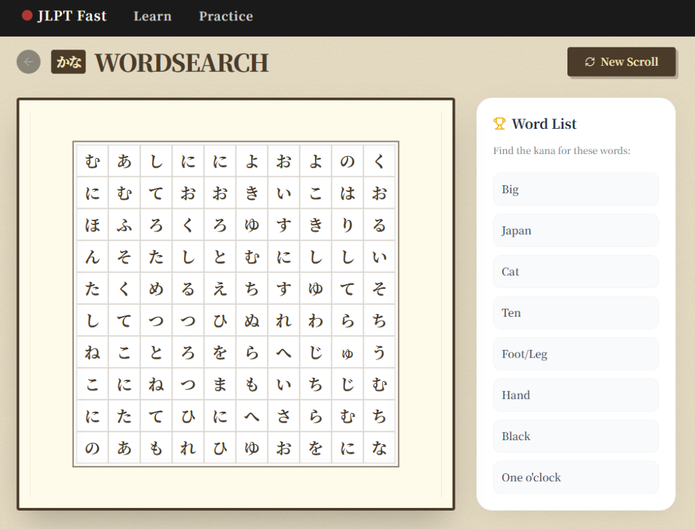
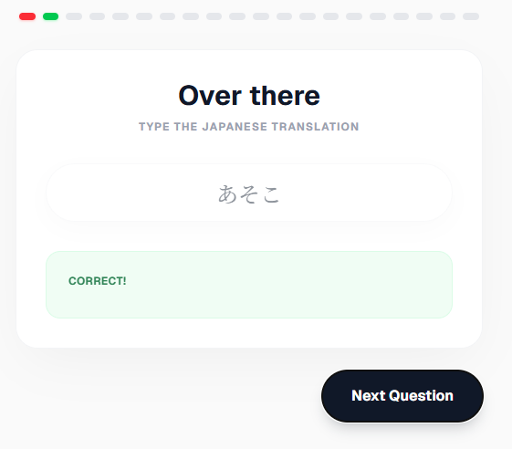

# JLPT N5 Fast Track 🇯🇵

A comprehensive, interactive learning platform designed to help you master the JLPT N5 exam. From Hiragana basics to essential grammar and vocabulary, this application provides a gamified path to fluency.

## 🌟 Key Features

### 1. Interactive Lessons & Progression
Follow a structured learning path ("The Wavy Path") that guides you through chapters covering:
- **Foundations**: Hiragana, Katakana, and Greetings.
- **Grammar**: Particles (wa, wo, ni, no), Conjugations, and Sentence Structure.
- **Kanji**: Basic characters (Numbers, Nature, Person) introduced progressively.
- **Vocabulary**: Food, Time, Daily Life, and more.

### 2. Gamified Practice Modes
Reinforce your learning with engaging mini-games:

**Kana Wordsearch**  
Find hidden words in a grid of characters to test your reading speed and vocabulary recognition.


**Smart Quizzes**  
Test your knowledge with varying question types including Multiple Choice, Matching, and Typing.


### 3. Typing & Translation
Practice your input skills with our smart Romaji-to-Kana converter. Type translations for sentences and vocabulary.

### 4. Immersion & Listening
Curated listening practice videos and conversation scenarios to train your ear to natural Japanese speeds.


## 🛠 Tech Stack

- **Framework**: [Next.js 14](https://nextjs.org/) (App Router)
- **Styling**: Tailwind CSS & Framer Motion for smooth animations.
- **Icons**: Lucide React.
- **Language**: TypeScript.

## 🚀 Getting Started

1. **Clone the repository**
   ```bash
   git clone https://github.com/yourusername/jlpt-fast.git
   ```

2. **Install dependencies**
   ```bash
   npm install
   # or
   pnpm install
   ```

3. **Run the development server**
   ```bash
   npm run dev
   ```

4. **Open your browser**
   Navigate to [http://localhost:3000](http://localhost:3000) to start learning!

## 📚 Curriculum Overview

- **Chapter 1: Foundations** - Intro to Kana & Greetings
- **Chapter 2: First Steps in Grammar** - Particles (Wa, No), Desu
- **Chapter 3: Numbers & Basic Kanji** - 1-10, Time, Intro to Kanji
- **Chapter 4: Daily Life** - Food, Verbs, Object Marker (Wo)
- **Chapter 5: People & Places** - Self Intro, Adjectives, Locations

## 🤝 Contributing

Contributions are welcome! Feel free to open issues or submit pull requests to help improve the learning experience for everyone.

---
*Ganbatte! (Good luck!)* 🗾
